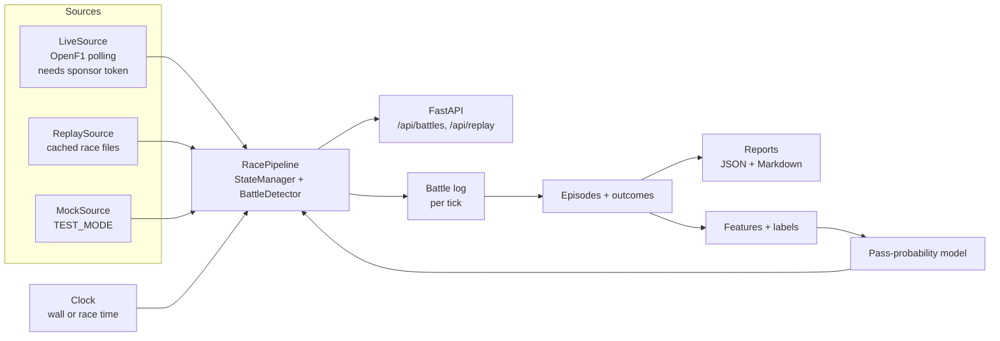

# F1 Battle Detector → Race Battle Intelligence

**Build plan: race replay, post-race battle reports, overtake prediction**

Repo: [`harmanpreet-sagar/F1-Battle-Detector-Summarizer`](https://github.com/harmanpreet-sagar/F1-Battle-Detector-Summarizer) · Baseline: `main` @ `90bc745` (Sep 8, 2026) · Plan written Sep 10, 2026

---

## Contents

1. [Why the pivot](#1-why-the-pivot)
2. [Decisions already made](#2-decisions-already-made)
3. [What we're building](#3-what-were-building)
4. [Where the code is today](#4-where-the-code-is-today)
5. [Phase 0: Foundations](#phase-0--foundations)
6. [Phase 1: Race Replay](#phase-1--race-replay)
7. [Phase 2: Post-race Battle Reports](#phase-2--post-race-battle-reports)
8. [Phase 3: Overtake Prediction](#phase-3--overtake-prediction)
9. [Cross-cutting work](#9-cross-cutting-work)
10. [Publishing the demo](#10-publishing-the-demo)
11. [Timeline](#11-timeline)
12. [Risks and mitigations](#12-risks-and-mitigations)
13. [Open questions](#13-open-questions)
14. [Reference: OpenF1 endpoints we use](#14-reference-openf1-endpoints-we-use)

---

## 1. Why the pivot

| Fact | Consequence |
|---|---|
| OpenF1 **live** data needs the paid Sponsor tier (€9.90/month). Data counts as live "from 30 minutes before a session starts until 30 minutes after it ends." | The project as originally designed can't run publicly for free. |
| OpenF1 **historical** data is free, needs no key, and covers every session since 2023. | Every race since 2023 is available, and each new race becomes free about 30 minutes after it ends. |
| Races only run for a few hours on race weekends. | A live-only demo shows nothing most of the time someone opens it. Live mode was a weak demo even before the paywall. |
| A live system has no ground truth. | You can't measure whether it flagged the *right* battles. Historical data tells you how every battle ended, so the project becomes measurable. |

**New positioning:** a race-analysis system that replays any race since 2023 through the detection engine, publishes a battle report after every Grand Prix, and predicts which battles will end in an overtake. It's measured on real outcomes.

**Not doing:** paid live data (the live code path stays, behind a flag); the unofficial F1 SignalR feed (needs F1 account auth, undocumented, not something to run a public app on); a mock-data-only demo.

---

## 2. Decisions already made

| Question | Decision |
|---|---|
| When to publish | **As soon as Phase 1 (replay) works.** Publish from Replit, then keep the live app updated as Phases 2–3 land. |
| How much happens in Replit | **Feature work happens in GitHub; deployment and the platform-shaped design work happen in the Replit workspace.** The Replit App is connected to this repo, so it isn't a copy — it's a checkout with a run configuration. The sleep-proof broadcast schedule (1.4) and single-app packaging (1.7) exist *because* of free-tier limits, so they get written and debugged there and merged back by PR. |
| Report text | **Template first, LLM later.** Deterministic, testable text now; LLM narrative as an optional layer with the template as fallback. |
| Where reports go | **In the web app** (a Reports page) **and as Markdown in the repo** (one file per race, committed automatically). |
| Budget | $0. Replit Starter (free) plan, OpenF1 free tier, GitHub Actions free minutes. |

---

## 3. What we're building

### 3.1 Three features on one engine

| Feature | What a user sees | What it proves technically |
|---|---|---|
| **Race Replay** | Pick a race (or land on the one playing now), watch battles appear and resolve at 1–20x speed, lap counter, safety car banner. | The detector works on real data. The same pipeline serves live and replay. Time is injected, not read from the wall clock. |
| **Post-race Battle Reports** | After every 2026 Grand Prix: top battles of the race, how each ended, gap charts, race-level stats. | Batch processing, event segmentation, outcome labelling, scheduled automation. |
| **Overtake Prediction** | "Pass chance in the next 3 laps: 38%" on battle cards; "biggest upset" in reports. | Dataset building, leakage-safe splits, baselines, calibration, model serving behind a flag. |

### 3.2 Core principle: one pipeline, many sources

The detector doesn't care where data comes from. Every mode feeds the same `RacePipeline`:



### 3.3 Data flow, end to end

1. **Ingest:** fetch one race's endpoints from OpenF1 once, store compressed on disk.
2. **Timeline:** merge the endpoints into a single time-ordered event stream.
3. **Replay:** step a race-time clock and hand the pipeline exactly what live polling would have returned at that moment.
4. **Batch analyze:** run the same replay with no sleeping, log every detection.
5. **Episodes:** stitch per-tick detections into battles with a start, an end and an outcome.
6. **Reports:** rank episodes, render JSON and Markdown.
7. **ML:** turn episodes into per-lap samples, train, evaluate, serve.

---

## 4. Where the code is today

**Working:** FastAPI backend (~1,700 lines of Python), Next.js 14 client-only dashboard, **62 backend tests passing**, CI on push/PR, Docker builds. Detection score = `0.5·gap + 0.3·closing + 0.2·pace`, thresholds WATCH 0.55 / HOT 0.70. All P0–P3 items from the earlier review are fixed.

**Blocks replay** (found by reading the code; each has a task below):

| # | Problem | Where | Why it breaks replay |
|---|---|---|---|
| B1 | Data confidence is computed as *row age vs `datetime.now()`* | `state.py:115-116`, `state.py:132` | A 2025 row is ~a year old, so every driver is `low` confidence. That sets `data_quality_warning`, multiplies every score by 0.7 and flags every battle. |
| B2 | Detector timekeeping uses `datetime.now()` | `battle.py:207`, `battle.py:226` | `first_seen`, `last_seen` and the 30s eviction run on wall time. At 10x speed an unseen battle survives 300 race-seconds instead of 30; in fast batch mode (thousands of ticks in a few wall-seconds) nothing is ever evicted. |
| B3 | Pipeline lives inside `main.py` poll loops with module-level singletons | `main.py`: `run_detection()`, `poll_positions()`, `poll_session_status()` | Can't run a replay, a batch analysis and the API side by side. They'd share one `state_manager` and `battle_detector`. |
| B4 | `track_status` is never set | `session.py:57` | `under_yellow` never fires. Under a safety car the whole field bunches to ~1s gaps, which will show up as a wave of fake HOT battles. |
| B5 | Tyres and pit stops are placeholders | `state.py:147-149` (`tire_compound=None`, `pit_stops_count=0`); pit detection is a ">10s gap jump" heuristic | Reports and ML need real compounds, tyre age and pit laps. `/stints` and `/pit` provide them. |
| B6 | `get_latest_laps()` returns "last N laps as of the request" | `openf1_client.py` | Replay needs "laps completed *as of race time t*", i.e. `date_start + lap_duration ≤ t`. |
| B7 | `current_lap` / `total_laps` are always `None` | `session.py:55-56` | The UI can't show "Lap 34/57", and reports can't say "laps 12–19". |

---

## Phase 0 — Foundations

> **Goal:** make time and data source injectable without changing behaviour. No new features.
> **Where:** GitHub (normal workflow). **Rough size:** 4–8 focused hours.

### 0.1 Clock abstraction (fixes B1, B2)

- Add `app/clock.py`:
  - `Clock` protocol with `now() -> datetime` (always timezone-aware UTC).
  - `WallClock`: real time.
  - `ReplayClock`: holds race time, advanced by the replay source; `set(t)`, `advance(dt)`.
- Pass `now` explicitly instead of calling `datetime.now()`:
  - `StateManager.update_from_openf1_positions(..., now: datetime)` for confidence and gap staleness.
  - `BattleDetector.detect(..., now: datetime)` for `first_seen`, `last_seen`, eviction and `detected_at`.
- `health.py` keeps wall time. Health is about the server, not the race.
- Make all internal datetimes timezone-aware UTC. `battle.py`, `session.py` and `mock_data.py` use naive `datetime.now()`, while OpenF1 timestamps are timezone-aware. Once race time is injected, comparing the two raises `TypeError`.

**Tests:**
- An eviction test driven by a fake clock: a battle unseen for 31 race-seconds is evicted regardless of wall time.
- A row timestamped 2025 with `now` = the same 2025 instant gets `high` confidence.

### 0.2 Extract `RacePipeline` (fixes B3)

- New `app/pipeline.py`:

```python
class RacePipeline:
    def __init__(self, clock: Clock, session: SessionContext): ...
    def ingest(self, tick: TickData) -> None      # positions, intervals, laps, race control, stints
    def detect(self) -> list[Battle]              # runs detection at clock.now()
    def reset(self) -> None
    # read-only views used by the API
    def current_states(self) -> list[DriverState]
    def latest_battles(self) -> list[Battle]
```

- `TickData` is a plain dataclass holding exactly what one live poll returns today (latest position row per driver, latest interval row per driver, recent laps, plus the new track status and stints).
- `main.py` keeps a registry of named pipelines (`"live"`, `"replay"`) in `app.state` instead of module globals. Endpoints read from the active one.
- Keep the old globals as thin aliases for one PR if that makes the diff reviewable, then delete them.

### 0.3 `DataSource` interface

```python
class DataSource(Protocol):
    clock: Clock
    session: SessionContext
    async def ticks(self) -> AsyncIterator[TickData]
```

- `LiveSource`: today's polling code from `poll_positions()` / `poll_session_status()` moved as-is. It accepts an optional `OPENF1_API_TOKEN`, so live mode still works for anyone with a sponsor subscription.
- `MockSource`: today's `TEST_MODE` generator.
- `ReplaySource`: built in Phase 1.
- One runner loop: `async for tick in source.ticks(): pipeline.ingest(tick); pipeline.detect()`.

### 0.4 Config

- `DATA_MODE = live | replay | mock`, defaulting to `mock` so CI stays network-free. Keep `TEST_MODE=true` as a deprecated alias for `mock`.
- `.env.example` and README updated.

**Acceptance for Phase 0:**
- [ ] All 62 existing tests pass unchanged (or with `now` threaded through fixtures).
- [ ] No `datetime.now()` left in `state.py` or `battle.py`.
- [ ] `DATA_MODE=mock` behaves exactly like `TEST_MODE=true` did.
- [ ] New clock tests pass.

---
## Phase 1 — Race Replay

> **Goal:** a public `replit.app` URL showing a real race replaying through the detector.
> **Where:** GitHub for 1.1–1.3, 1.5, 1.6 and 1.8; the Replit workspace (free Starter plan) for 1.4, 1.7 and publishing. **Rough size:** 15–25 focused hours.
> **Exit:** the demo is live and linked from the README.

### 1.1 Race ingest and cache

Command: `python -m app.ingest --year 2025 --round 14` or `--session-key <key>`

**Fetch** (per race session, one request per endpoint, sequential):

| Endpoint | Used for |
|---|---|
| `sessions` | session metadata, `date_start`/`date_end`, circuit |
| `drivers` | names, teams, acronyms (and team colours if present) |
| `position` | running order over time |
| `intervals` | `interval` (gap to car ahead) and `gap_to_leader`, about every 4s |
| `laps` | lap times, sector times, `st_speed`, `is_pit_out_lap` |
| `race_control` | safety car, VSC, flags, red flags (track status, fixes B4) |
| `stints` | compound, `lap_start`/`lap_end`, `tyre_age_at_start` (fixes B5) |
| `pit` | pit laps and `lane_duration` (fixes B5) |
| `overtakes` | official-ish pass list (race only, "may be incomplete"), used in Phase 2 |
| `session_result` | final classification, DNF/DNS/DSQ, used in Phase 2 |
| `starting_grid` | grid order for the lap-1 baseline |

**Don't fetch** `car_data` or `location` (~3.7 Hz telemetry: large, not needed yet).

**Storage:** `data/sessions/{session_key}/{endpoint}.json.gz` plus a `manifest.json` containing `session_key`, `year`, `round`, `circuit`, `fetched_at`, row count per endpoint, a content hash per endpoint and `schema_version`.

**Rules:**
- Refuse to fetch a session whose `date_end` is less than **45 minutes** ago. The live window ends at +30 min; the extra 15 is a buffer. This keeps us inside the free tier by construction.
- Sequential requests, a short pause between them, retry with exponential backoff, a descriptive `User-Agent`. OpenF1 doesn't document free-tier rate limits, so be polite and fetch each race **once**.
- Idempotent: if the manifest exists and its hashes match, skip.

**Measure and record** (the first thing to do in 1.1, since the numbers drive later choices): rows and compressed size per endpoint for one race, and total size for 5 races. Rough expectation: `intervals` ≈ 20 drivers × one row per ~4s × ~1.5–2h ≈ 30–40k rows. This is an estimate; replace it with the real number.

### 1.2 Timeline builder

`app/replay/timeline.py` merges the cached endpoints into one time-ordered stream:

| Event | Timestamp used |
|---|---|
| `PositionEvent` | `position.date` |
| `IntervalEvent` | `intervals.date` |
| `LapCompletedEvent` | `laps.date_start + lap_duration` (fixes B6). A lap only exists for the pipeline once it's finished. |
| `RaceControlEvent` → track status change | `race_control.date`, mapped: SafetyCar deployed → `sc`, VSC deployed → `vsc`, red flag → `red`, "track clear"/green → `green`, sector/double yellow → `yellow` |
| `StintEvent` | start of `lap_start` (from that lap's `date_start`) |
| `PitEvent` | `pit.date` |

**Edge cases to handle, each with a test:**
- Laps with a null `lap_duration` (in-progress, pit laps, some lap 1s): no `LapCompletedEvent`.
- Laps with a null `date_start`: fall back to the previous lap's end, else skip.
- `interval` / `gap_to_leader` as `"+1 LAP"` strings: already parsed to `None` by `parse_gap()`. Keep that.
- Pre-race rows (formation lap, grid): the replay starts at the first `LapCompletedEvent` of lap 1 minus lap 1's duration, or at `session.date_start`, whichever is later.
- **Red flags:** long periods with no events. Replay compresses any gap above 60 race-seconds to 5 seconds of playback and shows a "Red flag" banner.
- **Retirements:** a driver whose rows stop. Mark them retired after `session_result.dnf` or after 2 laps with no position/interval rows, and drop them from the running order so they don't create phantom battles.
- Timestamps: always timezone-aware UTC.

### 1.3 `ReplaySource` and `ReplayClock`

- **Tick size = the live poll interval (1.5 race-seconds).** Each tick hands the pipeline the *latest row per driver as of race time t*, which is exactly what `get_latest_positions()` / `get_latest_intervals()` would have returned if polled live at t. Same tick size means the stability filter (`BATTLE_MIN_DURATION_UPDATES`) and eviction behave the same as live.
- **Speed:** `REPLAY_SPEED` of 1, 5, 10 or 20. Wall sleep per tick = `1.5 / speed`.
- **Fast mode** (speed = ∞, no sleeping) is used by seek and by the Phase 2 batch analyzer.
- **Seek:** to jump to race time T, reset the pipeline and run fast mode from the race start to T. Twenty drivers and a few thousand ticks should take well under a second. **Measure it.** If it's slow, checkpoint pipeline state every 5 laps.
- **Playlist:** `REPLAY_PLAYLIST=9xxx,9yyy,...` (session keys). Loops forever.

**The "live-equivalence" test.** This is the strongest engineering claim in the project, so test it directly:
- Take a trimmed real race excerpt (fixture, ~10 laps).
- Path A: serve the rows through a fake HTTP layer to `LiveSource`, advancing a fake clock as if polling live.
- Path B: run the same rows through `ReplaySource`.
- Assert that the battles detected at every tick are identical.

### 1.4 Broadcast replay: one shared stream, stateless schedule

On a free Replit app with an unknown number of viewers, **one server-side replay that everyone watches** (like a TV channel) is the right v1:
- One pipeline, constant memory, regardless of viewers.
- The existing `/battles/top` dashboard works almost unchanged.
- Viewers can't fight over speed or race selection, because there are no public controls in v1.

**Surviving Replit's sleep:** free apps sleep after inactivity, and the replay can't just pause and resume. Make the schedule a pure function of wall-clock time:

```
playlist_duration = sum(race_durations) / REPLAY_SPEED
offset            = (wall_now - REPLAY_EPOCH) mod playlist_duration
→ (race, race_time) = locate(offset)
```

On boot or wake, compute where the broadcast *should* be, seek there in fast mode, then continue in real time. Every visitor sees the same moment. After a cold start it looks as if the replay kept running.

### 1.5 API changes

- Prefix every API route with **`/api`** (e.g. `/api/battles/top`, `/api/health`). This frees `/` for the frontend in single-app packaging (1.7). Update `frontend/app/lib/api-client.ts`.
- `GET /api/replay/status` returns `{mode, session_key, meeting_name, circuit, year, race_time, lap, total_laps, track_status, speed, progress_pct, next_race}`.
- `GET /api/replay/sessions` lists cached races from their manifests.
- `GET /api/session/current` gets real `current_lap` / `total_laps` (fixes B7). Current lap = max completed lap of the leader + 1; total laps from `session_result.number_of_laps` of the winner.
- `GET /api/health` adds `mode`, replay position and data manifest version.

### 1.6 Frontend

- **Header:** `REPLAY · 2025 <Grand Prix> · Lap 34/57 · 10x`, a race-time clock and a progress bar.
- **Honesty badge:** "Replay of real race data (OpenF1)". Never imply it's live.
- **Track status banner:** SC / VSC / red flag, with battles greyed out while it's active.
- **Era-aware wording:** the explanation text says "Within DRS range" for any gap < 1.0s (`battle.py`). That's right for 2023–2025 but wrong for 2026, which has no DRS. Use "Within 1s (Overtake Mode range)" for 2026 sessions.
- **Battle cards:** driver acronyms, team names (colours if `/drivers` provides them), gap sparkline (existing `Sparkline.tsx`), explanation text (existing), and tyre compound and age from stints.
- **"Up next"** strip showing the next race in the playlist.
- **Footer disclaimer:** "Unofficial. Not associated with Formula 1. Data: OpenF1."

### 1.7 Single-app packaging for Replit

| Change | Detail |
|---|---|
| Static frontend | `next.config.js`: `output: 'export'` (the app is fully client-side: `page.tsx` is `'use client'`, data via SWR). Keep `standalone` for the Docker path via an env switch. |
| Same-origin API | `API_BASE_URL` defaults to `''`, so the browser calls `/api/...` on the same host. No CORS needed in production; keep CORS for local dev. |
| FastAPI serves the UI | After registering `/api` routes, `app.mount("/", StaticFiles(directory="frontend/out", html=True))`. Delete the JSON `GET /` root (or move it to `/api`). |
| Replit config | `.replit` with Python 3.11 + Node modules, a run command (`uvicorn app.main:app --host 0.0.0.0 --port $PORT`), a build step (`cd frontend && npm ci && npm run build`) and deployment settings. Check the current `.replit` keys against Replit's docs when you write it; they change. |
| Build memory fallback | `next build` may run out of memory on a free workspace. If it does, a GitHub Action builds `frontend/out` and pushes it to a `replit-dist` branch, and Replit pulls that instead of building. |
| Replay data | Commit a **curated set of 5–8 races** (compressed) under `data/sessions/` so the app never depends on OpenF1 at runtime. If 1.1 shows the set is too big for comfort (target < 50 MB), trim the fields stored. |
| Docker / compose | Keep working for local dev: compose sets `DATA_MODE`, and the frontend dev server proxies `/api` to the backend. |

### 1.8 Tests (network-free, CI stays green on race weekends)

- `tests/fixtures/race_excerpt/`: ~10 laps of one real race, all endpoints, trimmed and committed. It must include at least one pit stop, one position swap and, ideally, a VSC or SC period.
- Timeline: ordering, lap-completion timestamps, null handling, red-flag compression, retirement.
- Replay: the tick at t equals latest-row-per-driver ≤ t; seek(T) state equals play-to-T state.
- Track status: **no HOT or WATCH battles while `sc`/`vsc` is active**, and battles recover after the restart.
- Live-equivalence test (1.3).
- Schedule: `locate(offset)` wraps correctly across playlist boundaries.
- API: `/api/replay/status` shape; static files served at `/`; `/api/*` still wins over static.

### 1.9 Splitting the work between GitHub and Replit

The two environments are the same repo, so the split is about *where a problem is cheapest to solve*, not about where the code lives.

| Work | Where | Why |
|---|---|---|
| 1.1–1.3 ingest, timeline, replay engine; 1.5 API; 1.6 frontend; 1.8 tests | GitHub, normal editor + PRs | Pure logic. Nothing about it is platform-specific, and the local test loop is faster. |
| 1.4 broadcast schedule | **Replit workspace** | The stateless schedule exists to survive the free tier's sleep. You can only tell whether it works by letting a real app sleep and wake. |
| 1.7 single-app packaging, `.replit`, build fallback | **Replit workspace** | Config keys, `$PORT` binding, build memory and static mounting are all properties of the platform. Guessing at them locally and pushing to see what breaks is the slow way round. |
| Publishing, secrets, the deployed app | **Replit workspace** | It's the deploy target. |

- Connect the repo to a Replit App early — before 1.4 — so packaging problems surface while there's still time to design around them, rather than at the end.
- Commit Replit-side work from the workspace on a `feature/replay-packaging` branch and merge it by PR, same as any other branch.
- Keep a short `docs/replit-build-log.md`: what was built in the workspace, problems hit (memory, sleep, build, config), how each was solved. Future-you will need it the next time the free tier shifts.
- Take 3–4 screenshots and a 30–60s screen recording (GIF or video) of the replay. These go in the README and keep the project presentable if the free published link expires (see §10).

### 1.10 Minimum shippable cut (if time runs short before publishing)

Must ship: 0.1–0.3, 1.1, 1.2, 1.3 (without seek optimisation), 1.4 with a **single race looping**, track status from race control, 1.5 prefix + status endpoint, 1.6 header + badge + SC banner, 1.7.

Can slip until after publishing: playlist of multiple races, stateless schedule (a restart from lap 1 on wake is acceptable), tyre info on cards, "up next", live-equivalence test (write it right after).

**Acceptance for Phase 1:**
- [ ] Public `replit.app` URL shows a real race replay with battles on screen within ~30s of a cold start.
- [ ] No battles shown during SC/VSC periods in the chosen race(s).
- [ ] Lap counter and race name correct; honesty badge and disclaimer visible.
- [ ] CI green; new tests added; `DATA_MODE=mock` still works.
- [ ] README has a demo link, screenshots/GIF and a "How replay works" section.
- [ ] Demo link verified in a private browser window and after a cold start.

---
## Phase 2 — Post-race Battle Reports

> **Goal:** after every 2026 Grand Prix, a ranked battle report appears in the app and in the repo with no manual step. The 2023–2025 back catalogue is filled in too.
> **Where:** GitHub + GitHub Actions. **Rough size:** 20–30 focused hours.

### 2.1 Batch analyzer

Command: `python -m app.analyze --session-key <key>`

- Runs `ReplaySource` in fast mode through a fresh `RacePipeline`.
- To avoid hiding battles the stability filter hasn't matured yet, it logs **every candidate pair with score and intensity at every tick**, not just shown battles. It writes `data/derived/{session_key}/battle_log.jsonl.gz`, one line per tick: race time, lap, track status, and all candidate pairs with gap, closing rate, pace delta, score, intensity and flags.
- Also writes `laps_table.parquet` or `.csv.gz` (per driver per lap: position at lap end, lap time, sectors, `st_speed`, compound, tyre age, pit in/out, track status during lap). Phase 3 builds features from this.

### 2.2 Battle episodes

A battle as a human understands it spans many ticks, and **the drivers swap roles when the pass happens**. The detector's `battle_id` (`{chaser}_{ahead}`) flips at exactly the moment we care about most.

**Segmentation rules** (`app/reports/episodes.py`):
- Episode key = the **unordered** driver pair `{a, b}`.
- Start: first tick the pair reaches WATCH or HOT.
- Continue while the pair is adjacent and gap ≤ `EPISODE_MAX_GAP_S` (default 2.0s), allowing breaks of up to `EPISODE_MERGE_S` (default 1 lap) for interval-feed noise.
- **Role swap inside an episode is allowed.** That's the pass.
- End when: the gap exceeds the max for more than the merge window, either car pits, either car retires, a car between them splits the pair for more than 1 lap, or the race ends.
- SC/VSC periods **pause** an episode rather than ending it. Pre-SC and post-restart fighting between the same pair is one story, but SC time doesn't count toward duration.
- Discard episodes shorter than `EPISODE_MIN_LAPS` (default 1 lap) unless they end in a pass.

**Episode record:**

```jsonc
{
  "episode_id": "2025-14-4-81-1",
  "drivers": [4, 81], "attacker_start": 81, "defender_start": 4,
  "start": {"t": "...", "lap": 12}, "end": {"t": "...", "lap": 19},
  "laps": 7.4, "sc_laps_excluded": 0,
  "positions_at_stake": [5, 6],
  "gap": {"min": 0.31, "mean": 0.74, "series": [[t, gap], ...]},   // downsampled to ~1 point per 4s
  "peak_score": 0.81, "time_hot_s": 96, "time_watch_s": 312,
  "max_closing_rate": -0.031, "pace_delta_mean": -0.42,
  "within_1s_laps": 5,
  "tyres": {"attacker": {"compound": "MEDIUM", "age_start": 4}, "defender": {"compound": "HARD", "age_start": 17}},
  "outcome": "PASS", "outcome_lap": 18, "label_source": "both",
  "end_reason": "gap_opened"
}
```

### 2.3 Outcome labelling

| Outcome | Rule |
|---|---|
| `PASS` | The attacker is ahead at episode end (from `position`) and stayed ahead for ≥ 2 laps, and the swap wasn't caused by a pit stop. |
| `PASS_AND_REPASS` | The order swapped and then swapped back inside the episode. |
| `HELD` | The defender was still ahead when the episode ended on gap/race end. |
| `ENDED_BY_PIT` | The episode ended because either car pitted (`/pit`). |
| `ENDED_BY_SC` | An SC/VSC neutralised it and the fight didn't resume. |
| `ENDED_BY_DNF` | Either car retired. |

**Pass evidence is cross-checked from two sources:**
- `overtakes` rows between the two drivers inside the episode window (OpenF1 says this endpoint "may be incomplete").
- `position` order changes between the two drivers, **excluding** swaps where either car was in the pit lane that lap, and swaps involving a lapped car.
- `label_source` = `overtakes` | `position` | `both`. **Report the agreement rate** between the two sources per season. That's a label-quality number to quote, and the input for deciding which source Phase 3 trusts.

### 2.4 Ranking: "battles of the race"

`battle_rank_score` is a documented formula with weights in config and every term unit-tested:

| Term | Intuition | Default weight |
|---|---|---|
| Duration (laps, capped at 15) | Long fights are better stories | 0.25 |
| Closeness (share of time within 1.0s) | Close means real threat | 0.25 |
| Peak intensity (max detector score) | Uses the existing engine | 0.15 |
| Outcome drama: `PASS_AND_REPASS` > `PASS` > `HELD` > `ENDED_BY_*` | Something happened | 0.20 |
| Stakes: podium (P1–P3) > points boundary (P10/P11) > points > rest | Matters to the result | 0.15 |

Tune the weights once by eye on 3–4 races you watched, then **freeze them** and commit the reasoning. They must not be retuned per race.

### 2.5 Report content (template-based)

**Per race** (`reports/{year}/{round:02d}-{slug}.json` + `.md`):

1. **Header:** Grand Prix name, circuit, date, winner, number of laps, SC/VSC/red flag periods.
2. **Race at a glance:** episodes detected, passes detected vs rows in `/overtakes`, longest battle, closest battle (lowest mean gap over ≥ 3 laps), most-defended driver (most `HELD` outcomes).
3. **Top 5 battles.** Each has:
   - Title: `VER vs NOR · P2 · Laps 31–44`
   - 2–3 generated sentences, e.g. *"NOR closed from 1.4s to 0.3s over four laps on tyres 11 laps fresher, then passed on lap 41. VER re-passed a lap later but lost the place for good on lap 43."*
   - Gap-over-time chart (web: Recharts, already a dependency; Markdown: a small PNG rendered by matplotlib in the Action, or a sparkline table if PNGs bloat the repo).
   - Outcome badge.
4. **All other episodes:** a compact table.
5. **Method note:** a link to how detection, episodes and outcomes work, and known limitations.

**Template rules:**
- Every sentence is assembled from episode fields. There's no free text, so there's nothing to hallucinate.
- A small phrase bank per situation (closing, holding, undercut, tyre offset, SC restart) with deterministic selection (hash of episode id), so reports don't all read the same while staying reproducible.
- Snapshot tests: fixture episode → exact expected sentences.

### 2.6 Outputs

**Markdown in repo:** `reports/2026/15-italian-gp.md`, plus `reports/README.md` as a season index table, regenerated on every run.

**Web app:**
- `reports/index.json` (season → races → headline) and one JSON file per race.
- New pages: **Reports index** (season tabs, race cards with the #1 battle headline) and **Report view** (`/reports/?race=2026-15`).
  - Use a query parameter rather than dynamic routes so `output: 'export'` never needs a rebuild when a report is added.
- **Getting new reports into a published Replit app without redeploying:** the backend serves `/api/reports/*` by fetching the JSON from the repo's raw GitHub URL (`REPORTS_SOURCE_URL`), cached for 10 minutes, falling back to the copy bundled at deploy time. A new race's report shows up on the live site as soon as the Action commits it.

### 2.7 Automation: GitHub Actions

`.github/workflows/race-reports.yml`:

- **Triggers:** `schedule` every 6 hours, plus `workflow_dispatch` with optional `session_key` / `year` inputs for backfills and re-runs.
- **Steps:**
  1. List 2026 `Race` sessions with `date_end < now − 45 min` that have no report, or whose report is < 48h old (re-run once, since data can fill in after the race).
  2. For each: `ingest → analyze → episodes → report`.
  3. Compare the new manifest hashes with the previous ones and regenerate only if data changed.
  4. Commit with a bot identity (`reports: 2026 R15 Italian GP`) to `main`. Permissions: `contents: write`.
- **Separate from CI.** The existing CI stays network-free. This workflow is the only thing that talks to OpenF1.
- **Raw data** isn't committed for all seasons. Raw caches are uploaded as **Actions artifacts / GitHub Release assets** (`data-2025.tar.gz`). Only derived episodes, laps tables and reports are committed. This keeps the repo small and the Replit workspace under its 2 GB storage limit.
- **Failure notification:** the workflow fails loudly (red X, email from GitHub) if a race older than 24h still has no report.

**Backfill:** run the dispatch once per season for 2023, 2024, 2025 and 2026-to-date. This produces the historical reports and **the Phase 3 dataset**. Sprint races: include them in the data (flagged `is_sprint`), but reports cover Grands Prix only in v1.

### 2.8 Detector evaluation (the first real metric, and it comes free here)

Once outcomes exist, measure the *existing heuristic* before any ML:

- **Pass coverage:** share of position-confirmed, non-pit passes in 2025 preceded by a WATCH/HOT detection for that pair within the previous 3 laps.
- **HOT precision:** share of HOT episodes that end in `PASS` or `PASS_AND_REPASS`.
- **SC false-positive check:** count of WATCH/HOT ticks during SC/VSC. Should be ~0 after B4.

These numbers go in the README and give Phase 3 its baseline.

### 2.9 LLM narrative (optional, after templates are solid)

- Input: the race's episode JSON and stats only. No raw data, no web.
- Output: a 120–200-word race battle story per report, stored in the report JSON (`narrative` field). It's generated **once** in the Action, never at page load.
- **Fact guard:** extract every driver code, lap number, position and time from the output. If any isn't present in the input facts, discard the narrative and fall back to the template text.
- The API key lives in a GitHub Actions secret. Choose a provider with a usable free tier at the time you build this, since those change often.
- Flag in the UI: "Narrative generated from race data by an LLM, checked against the numbers."

### 2.10 Tests

- Episode segmentation on synthetic gap series: a simple hold; a pass with role swap staying one episode; a pit ending an episode; SC pausing without ending; a car splitting the pair.
- Outcome rules: a pit-induced swap isn't a `PASS`; a lapped-car swap is ignored; a repass is detected.
- Ranking terms; the index regenerates; snapshot tests for the Markdown and JSON of the fixture race.
- A dry-run mode for the workflow script against the fixture (no network), run in CI.

**Acceptance for Phase 2:**
- [ ] The next 2026 Grand Prix after merge gets a report in the repo and on the site with no manual action.
- [ ] Reports exist for all 2025 Grands Prix (and ideally 2023–2024).
- [ ] Label source agreement rate and detector evaluation metrics (2.8) published in the README.
- [ ] Reports page live on the Replit app.

---
## Phase 3 — Overtake Prediction

> **Goal:** replace hand-picked weights with a model that predicts whether a battle ends in a pass, beats the heuristic on held-out races, and is honest about its limits.
> **Where:** GitHub for code; training locally or in Colab (not Replit, because of free-tier RAM). **Rough size:** 30–50 focused hours.

### 3.1 Problem framing

**Question:** *Given an active battle at the end of lap L, will the attacker complete a pass on the defender within the next H laps?*

- **Unit of prediction:** one sample per **(episode, completed lap)**. Per-tick samples would be thousands of near-duplicate rows that inflate the dataset and leak between train and test.
- **Horizon:** `H = 3` laps by default; also report `H = 1` and `H = 5`.
- **Label:** 1 if the attacker is ahead of the defender at the end of any lap in `L+1 … L+H` **and** it wasn't pit-induced (Phase 2 outcome rules), else 0.
- **Which label source:** decide from the Phase 2 agreement rate. Default is position-based passes with the pit/lapped-car exclusions, using `overtakes` as a cross-check feature for label noise analysis, never as an input feature.
- **Framing considered and rejected for v1:** "will this *episode* ever end in a pass?" It's simpler, but it can't update during a battle, which is what the replay UI needs.

### 3.2 Dataset

- Built from the Phase 2 laps tables and episodes for 2023, 2024, 2025 and 2026-to-date, Grands Prix plus sprints (`is_sprint` flag).
- **Measure and report before modelling:** number of races, episodes, samples, positive rate, positives per season. Expect heavy class imbalance, since most battle-laps don't end in a pass.
- Output: `ml/data/samples_{season}.parquet` (derived, small, committed) and a `datasheet.md` (fields, filters, known gaps per season).

### 3.3 Features (all knowable at the end of lap L)

| Group | Features |
|---|---|
| Gap dynamics | gap at lap end; mean and min gap over lap L; gap change over last 1 and 3 laps; closing rate (existing function) |
| Pace | lap-time delta last 1 / 3 laps (existing `calculate_pace_delta`); per-sector deltas from `duration_sector_1..3` |
| Straight-line | `st_speed` delta, `i1_speed`/`i2_speed` deltas (speed-trap advantage is a big factor in passing) |
| Tyres | attacker and defender compound; tyre age each; **age delta**; compound offset (softer vs harder); laps into stint |
| Battle history | laps in episode so far; count of "near misses" (gap < 0.5s then reopened) so far; time within 1.0s |
| Race context | race progress (L / total laps); positions at stake (podium / points boundary); laps since last SC/VSC restart; track status during lap L; `is_sprint` |
| Conditions | rainfall / track temperature from `weather` (add in v2 if coverage is good) |
| Circuit | circuit pass-difficulty prior = pass rate per battle-lap at that circuit **computed from training seasons only** |
| Heuristic | the existing detector's peak score during lap L, both as a feature and as a standalone baseline |

**Leakage rules (write them as tests):**
- No feature may read any row timestamped after the end of lap L.
- No `session_result`, no `overtakes`, no final positions.
- Circuit priors are computed inside each training fold only.
- Samples from the same race never appear in both train and test.

### 3.4 Regulation change: 2026 is a different sport for passing

2026 rules replaced DRS with active aero and an **"Overtake Mode"** energy boost available to a car running within about one second of the car ahead. Passing dynamics learned on 2023–2025 may not transfer. This isn't a problem to hide; it's the most interesting finding the project can report.

**Evaluation design:**

| Split | Train | Validate | Test | Answers |
|---|---|---|---|---|
| **A: within-era** | 2023–2024 | 2025 first half | 2025 second half | How good is the model under stable rules? |
| **B: cross-era** | 2023–2025 | (reuse A's settings) | 2026 races to date | How much does it degrade under new rules? |
| **C: adapted** | 2023–2025 + 2026 first half, with a `season_2026` indicator (or 2026-only fine-tune) | — | 2026 second half | Does a little new-era data recover the drop? |

- All splits are **temporal by race**. Never random, since consecutive laps of one battle are near-identical.
- Inside training data, use **grouped cross-validation by race** for hyperparameters.
- Confidence intervals by **bootstrapping over races**, not samples.

### 3.5 Baselines and models

**Baselines** (must be beaten to claim anything):
1. **Base rate:** predict the training positive rate for everyone.
2. **Heuristic score:** the existing detector score used as a probability-like ranking, plus "HOT ⇒ pass" as a hard classifier.
3. **Simple rule:** gap < 1.0s **and** attacker faster over last 3 laps.

**Models:**
1. **Logistic regression:** standardised features, class weights, L2. Interpretable coefficients go straight into the README.
2. **Gradient boosting:** scikit-learn `HistGradientBoostingClassifier` (no extra dependency), early stopping on validation.
3. **Calibration:** isotonic or Platt on the validation split. The UI shows percentages, so they have to mean something.

### 3.6 Metrics

| Metric | Why |
|---|---|
| **PR-AUC** (primary) | Imbalanced classes. ROC-AUC flatters. |
| ROC-AUC | Comparable with other work |
| Precision at recall 0.5, and precision@k per race (top-k battle-laps flagged) | Maps to "if we highlight 5 battles, how many deliver?" |
| **Brier score + calibration curve** | Probabilities shown to users must be trustworthy |
| Per-circuit and per-season breakdown | Where it fails (street circuits, wet races) |
| Split A vs B vs C comparison | The regulation-change story |

**Headline for the README** (fill in real numbers):
> "On held-out 2025 races, the model reached PR-AUC **X** vs **Y** for the rule-based detector. Under 2026's new overtaking rules, performance dropped to **Z**; adding half a season of 2026 data recovered it to **W**."

### 3.7 Code layout

```
ml/
  build_dataset.py      # laps tables + episodes → samples parquet (deterministic, tested)
  features.py           # pure functions, shared with serving
  splits.py             # temporal and race-grouped splits
  train.py              # baselines + logreg + GBM, writes artifacts and metrics.json
  evaluate.py           # tables, curves, bootstrap CIs → ml/reports/
  model_card.md         # data, splits, metrics, limitations, intended use
  artifacts/
    pass_model_v1.json  # logreg: coefficients + scaler + calibration map (no pickle)
    pass_model_v1.joblib# GBM, only if it wins by a meaningful margin
```

- **`features.py` is imported by both training and the backend**, so training and serving compute features identically. Add a test that asserts identical feature vectors from the training path and the serving path for the fixture race.
- **Serving preference:** if logistic regression is within noise of GBM, ship logistic regression as pure-Python coefficients. That means zero new runtime dependencies and a tiny memory footprint on Replit free. Only add scikit-learn to the backend if GBM wins clearly.

### 3.8 Integration

- `PASS_MODEL = none | logreg | gbm` (default `none` until the model card is done).
- **Replay:** at each lap completion, active battles get `pass_prob_next_3_laps`. The card shows "Pass chance (3 laps): 38%" with a tooltip explaining what it means and a link to the model card.
- **Reports:** for each top battle, a probability-over-laps mini chart; race-level "**Biggest upset**" (a pass that happened at the lowest predicted probability) and "**Best defence**" (highest cumulative predicted probability that was held).
- **API:** `/api/battles/top` includes `pass_prob` when enabled; `/api/model` returns the version, training data window and headline metrics.

### 3.9 Retraining

- `workflow_dispatch` workflow `retrain.yml`: rebuild dataset → train → evaluate.
- **Promotion gate:** the new model is promoted only if it beats the current one on the *fixed* test split's PR-AUC with no calibration regression (Brier score not worse by more than a set tolerance). Otherwise it saves metrics and exits without swapping.
- Run it manually after every few 2026 races. Don't schedule it; retraining should be a decision.

**Acceptance for Phase 3:**
- [ ] Dataset datasheet and leakage tests committed.
- [ ] Model card with Split A/B/C results, baselines, calibration and bootstrap CIs.
- [ ] Model served behind `PASS_MODEL` in replay and reports.
- [ ] README headline numbers filled in with real results, including where it doesn't work.

---
## 9. Cross-cutting work

### 9.1 Repository layout after all phases

```
F1-Battle-Detector-Summarizer/
├── .github/workflows/
│   ├── ci.yml                 # unchanged: network-free tests, lint, build (+ static export)
│   ├── race-reports.yml       # Phase 2: scheduled ingest → analyze → report → commit
│   ├── replit-dist.yml        # Phase 1 fallback: build frontend/out if Replit OOMs
│   └── retrain.yml            # Phase 3: manual retrain with promotion gate
├── .replit                    # Phase 1
├── backend/app/
│   ├── clock.py               # Phase 0
│   ├── pipeline.py            # Phase 0
│   ├── sources/{live,mock,replay}.py
│   ├── replay/{timeline,schedule}.py
│   ├── ingest.py  analyze.py
│   ├── reports/{episodes,outcomes,ranking,templates,render}.py
│   └── (existing) state.py battle.py models.py openf1_client.py session.py health.py config.py
├── frontend/app/
│   ├── page.tsx               # replay dashboard
│   └── reports/page.tsx       # index + ?race= view
├── ml/                        # Phase 3
├── data/
│   ├── sessions/              # curated replay races only (committed, compressed)
│   └── derived/               # episodes + laps tables (committed, small)
├── reports/                   # Phase 2: Markdown + JSON per race, season index
└── docs/
    ├── how-replay-works.md
    ├── how-reports-work.md
    └── replit-build-log.md
```

### 9.2 Config reference (new)

| Variable | Default | Phase |
|---|---|---|
| `DATA_MODE` | `mock` | 0 |
| `OPENF1_API_TOKEN` | unset (live mode needs it) | 0 |
| `REPLAY_PLAYLIST` | curated session keys | 1 |
| `REPLAY_SPEED` | `10` | 1 |
| `REPLAY_EPOCH` | fixed ISO timestamp | 1 |
| `EPISODE_MAX_GAP_S` / `EPISODE_MERGE_S` / `EPISODE_MIN_LAPS` | `2.0` / 1 lap / `1` | 2 |
| `REPORTS_SOURCE_URL` | raw GitHub URL of `reports/` | 2 |
| `PASS_MODEL` | `none` | 3 |

### 9.3 Testing and CI principles

- **CI never touches the network.** Everything runs on committed fixtures. Only `race-reports.yml` and `retrain.yml` talk to OpenF1.
- One real, trimmed race excerpt is the shared fixture for replay, episodes, reports and feature parity tests.
- Add `npm run build` with static export to CI so an export-breaking change fails the PR.
- Coverage gate on new modules: aim for ≥ 85% on `replay/`, `reports/` and `ml/features.py`.

### 9.4 Data etiquette and legal hygiene

- Fetch each race once, cache it, sequential requests, backoff. Credit OpenF1 in the README and app footer.
- "Unofficial, not associated with Formula 1 companies" disclaimer. No F1 logos or trademarked graphics; use driver acronyms and team names as plain text only.
- Only use historical data (the 45-minute guard in 1.1). Never scrape the official live timing feed.

### 9.5 Documentation

README rewrite at the end of each phase, in this order: demo link + GIF → what it does (3 features) → headline metrics → architecture diagram (§3.2) → how replay equals live → how reports and outcomes work → model card link → limitations → local setup → project history (the P0–P3 fixes doc is worth linking; it shows debugging).

---

## 10. Publishing the demo

### 10.1 Before sharing the link

- [ ] Published app link works in a private browser window and after a cold start.
- [ ] README top section has the demo link, GIF and a 3-line summary of what the project does.
- [ ] `docs/replit-build-log.md` exists.
- [ ] The published `replit.app` URL and the GitHub repo link are both recorded somewhere durable.

### 10.2 The 30-day free-publish limit

The free plan's published link **goes down after 30 days**.

- Note the publish date and put a reminder on day 25.
- Before the link expires, check whether the free plan lets you republish. This couldn't be confirmed in advance.
- The GIF, screenshots and README carry the project even while the link is down.
- Re-publishing after Phase 2 lands naturally resets the clock, if republishing is allowed.

### 10.3 Optional: a database for reports

Everything is files today. Storing episodes and reports in Replit's database or SQLite, and querying them for the Reports page, would remove the raw-GitHub fetch described in 2.6 and make season filtering and cross-race queries cheap. Worth a small task after Phase 2 if time allows; files are fine until the report count makes them awkward.

---

## 11. Timeline

Assumes roughly **20 focused hours/week**. Scale the dates if your availability differs. The dates are proposals, not commitments.

| Window | Work | Milestone |
|---|---|---|
| **Sep 11–12** | Phase 0 (clock, pipeline, sources) | PR merged, CI green |
| **Sep 12–18** | Phase 1: ingest, timeline, replay in GitHub; schedule, packaging and publish in Replit | Public `replit.app` URL |
| **~Sep 19** | README, GIF, build log, checklist in §10.1 | **Demo published and shareable** |
| Sep 21 – Oct 4 | Phase 2 (analyzer, episodes, outcomes, reports, Action, backfill) | Reports page live; first automatic 2026 report |
| Oct 5–11 | Detector evaluation (2.8), README metrics, optional database task (§10.3) | First real metrics published |
| Oct 12 – Nov 15 | Phase 3 (dataset, features, splits, models, model card, serving) | Pass probability live behind flag |
| Rest of season | Automatic reports; one or two manual retrains | Season-long track record |

If the Phase 1 date slips, publish the **minimum shippable cut** (§1.10) rather than waiting for the full feature set.

---

## 12. Risks and mitigations

| Risk | Likelihood | Impact | Mitigation |
|---|---|---|---|
| `next build` runs out of memory on a free Replit workspace | Medium | Blocks publish | `replit-dist.yml` builds in Actions; Replit pulls prebuilt `frontend/out` |
| Free published link expires after 30 days | High | Visitors hit a dead link | Day-25 reminder; check republish; GIF and screenshots in README |
| App sleeps; cold start shows nothing | High | Bad first impression | Stateless schedule + fast seek; loading state that says "Warming up replay…" |
| OpenF1 rate limits (undocumented) or temporary outage | Medium | Ingest fails | Fetch once and cache; backoff; curated races committed so the app never needs OpenF1 at runtime |
| `overtakes` endpoint incomplete | Known | Noisy labels | Cross-check with position changes; publish agreement rate; position-based labels by default |
| Safety car / VSC produces fake battles | High until B4 fixed | Detector looks broken on real data | Race control → track status in Phase 1; explicit test |
| Interval feed gaps or lag | Medium | Jumpy gaps, bad closing rates | Existing gap-sample timestamps + staleness logic; episode merge window |
| 2026 rules break the model | High | Worse 2026 predictions | Planned Split B/C evaluation; report it openly |
| Replit's 2 GB storage | Low with plan | Workspace full | Only curated races in Replit; bulk raw data in Actions artifacts/Release assets |
| Scope creep before publishing | High | Demo never goes live | Hard cut line in §1.10; publish first, polish after |
| Wall-clock bugs hiding elsewhere | Medium | Subtle replay errors | Grep-enforced rule: no `datetime.now()` outside `clock.py`, `health.py` and `sources/mock.py` (add a test that fails on it) |

---

## 13. Open questions

None of these block Phase 0. Answer them as each phase starts.

1. **Replay playlist:** which 5–8 races? Suggest picking them *after* 1.1 measures sizes, favouring races with varied scenarios (SC period, tyre-offset fights, a wet race if data coverage is good).
2. **Prediction horizon:** is 3 laps the right primary horizon for the UI, or is "next lap" more intuitive to show?
3. **Sprints in reports:** data only (current plan), or separate sprint reports too?
4. **LLM provider** for 2.9: pick when you get there, based on free tiers available at that time.
5. **Repo name:** keep `F1-Battle-Detector-Summarizer` (fits well now that Summarizer is real) or rename?
6. **Database task** (§10.3): move episodes and reports into a database after Phase 2, or do flat files stay good enough?

---

## 14. Reference: OpenF1 endpoints we use

| Endpoint | Key fields | Notes |
|---|---|---|
| `sessions` | `session_key`, `session_name`, `session_type`, `date_start`, `date_end`, `circuit_short_name`, `year`, `is_cancelled` | Filter `session_type=Race`; `session_name` distinguishes Sprint |
| `drivers` | `driver_number`, names, `team_name` | Per session |
| `position` | `date`, `driver_number`, `position` | No gap fields (that was the old P0-1 bug) |
| `intervals` | `date`, `driver_number`, `interval`, `gap_to_leader` | Races only; ~every 4s; `"+1 LAP"` strings for lapped cars |
| `laps` | `lap_number`, `date_start`, `lap_duration`, `duration_sector_1..3`, `i1_speed`, `i2_speed`, `st_speed`, `is_pit_out_lap` | Values may not exactly match TV graphics |
| `race_control` | `date`, `category` (Flag, SafetyCar, …), `flag`, `scope`, `sector`, `lap_number`, `message` | Source of track status |
| `stints` | `stint_number`, `lap_start`, `lap_end`, `compound`, `tyre_age_at_start` | Tyres |
| `pit` | `date`, `lap_number`, `lane_duration`, `stop_duration` | `stop_duration` from the 2024 US GP onwards; `pit_duration` deprecated |
| `overtakes` | `date`, `overtaking_driver_number`, `overtaken_driver_number`, `position` | Races only; "may be incomplete" |
| `session_result` | `position`, `number_of_laps`, `dnf`, `dns`, `dsq`, `duration`, `gap_to_leader` | Final classification |
| `starting_grid` | grid positions | Available after official results |
| `weather` | rainfall, temperatures | Every minute; Phase 3 v2 |

**Sources:** [OpenF1 (pricing, live vs historical)](https://openf1.org/) · [OpenF1 API docs](https://openf1.org/docs/) · [Replit Starter plan](https://docs.replit.com/billing/plans/starter-plan) · [F1 2026 terms explained (The Race)](https://www.the-race.com/formula-1/boost-overtake-mode-active-aero-recharge-key-2026-terms-explained/) · [FastF1 PR #760 (live timing auth)](https://github.com/theOehrly/Fast-F1/pull/760)